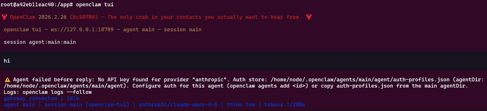

# OpenClaw A to Z 완벽 정리

OpenClaw를 도커 컨테이너에 격리하여 사용하는 방법을 완전히 재현 가능하게 정리하였습니다.

# 1. Docker 설치

```jsx
sudo apt update
sudo apt install -y ca-certificates curl gnupg lsb-release

sudo mkdir -p /etc/apt/keyrings

curl -fsSL https://download.docker.com/linux/ubuntu/gpg | \
sudo gpg --dearmor -o /etc/apt/keyrings/docker.gpg

sudo chmod a+r /etc/apt/keyrings/docker.gpg

echo \
"deb [arch=$(dpkg --print-architecture) signed-by=/etc/apt/keyrings/docker.gpg] \
https://download.docker.com/linux/ubuntu \
$(lsb_release -cs) stable" | \
sudo tee /etc/apt/sources.list.d/docker.list > /dev/null

sudo apt update
sudo apt install -y docker-ce docker-ce-cli containerd.io docker-buildx-plugin docker-compose-plugin

sudo systemctl status docker

sudo groupadd docker
sudo usermod -aG docker $USER

재부팅!
```

- 여기까지 진행하시고 `docker ps -a` 를 했을 때 오류가 나지 않으면 도커 설치는 잘 됐습니다.

# 2. OpenClaw를 위한 docker 설정

```jsx
mkdir openclaw-docker
cd openclaw-docker
```

- 우리는 openclaw-docker라는 폴더 한개만을 사용해서 이 안에 openclaw 생태계를 구축할 예정입니다. openclaw는 이 폴더 한개만을 자신의 세상이라 생각하기 때문에 우리 컴퓨터에 있는 중요한 정보에 접근할 수 없습니다.

## 2.1 Dockerfile 설정

```jsx
sudo vim Dockerfile
```

```jsx
FROM node:22-slim

RUN apt-get update && \
    apt-get install -y \
      git \
      python3 \
      build-essential && \
    npm install -g openclaw && \
    apt-get clean

WORKDIR /app
ENV HOME=/home/node
```

- 위의 내용을 Dockerfile에 붙여넣고, Esc 키를 누른 후 `:wq!` 키를 누르면 저장됩니다.

## 2.2 Dockerfile build

```jsx
docker build -t openclaw-node22 .
```

## 2.3 Docker compose

```jsx
sudo vim docker-compose.yml
```

```jsx
services:
  openclaw:
    image: openclaw-node22
    container_name: openclaw
    working_dir: /app
    ports:
      - "18789:18789"
    volumes:
      - ./openclaw:/home/node/.openclaw
    environment:
      HOME: /home/node
    command: ["openclaw","gateway","--bind", "loopback","--port", "18789","--allow-unconfigured"]
    restart: unless-stopped
```

## 2.4 Docker compose 실행

```jsx
# 아래 명령어를 통해 openclaw 게이트웨이를 띄울 수 있습니다.
docker compose up -d

# 아래 명령어는 게이트웨이를 내리는 명령어입니다. 컨테이너 내부 오류가 나면 한번씩 내렸다가 다시 실행해주세요.
docker compose down

# 아래 명령어는 직접 도커 컨테이너 내부로 진입 가능합니다.
docker compose exec openclaw bash
```

# 3. Openclaw 설정

```jsx
docker compose exec openclaw bash
openclaw setup
openclaw tui
```

- 여기까지 하면 아래와 같이 API 키가 없다고 합니다.



```jsx
openclaw config
```


- 저는 openAI의 Pro 플랜 사용중이라 Codex 인증을 진행하겠습니다. 가끔 인증 끝나면 오류창 뜨는데 오류창 링크 복사해서 붙여넣으면 됩니다.
- 저는 openai-codex/coxed 5.3 버전을 선택했습니다.
- 다시 `openclaw tui`  실행


# 4. Gateway 설정

1. `docker-compose.yml` 파일 수정

```jsx
services:
  openclaw:
    image: openclaw-node22
    container_name: openclaw
    ports:
      - "18789:18789"
    volumes:
      - ./openclaw:/home/node/.openclaw
    command:
      [
        "openclaw",
        "gateway",
        "run",
        "--bind", "lan",
        "--port", "18789",
      ]
    restart: unless-stopped
```

1. `openclaw.json` 수정

```jsx
vim openclaw-docker/openclaw/openclaw.json 
```

```jsx
"gateway": {
    "controlUi": {
      "dangerouslyAllowHostHeaderOriginFallback": true
    }
```

- Gateway 쪽에 추가하고 `:wq!` 저장

 이후 `docker compose up -d` 실행

1. [`localhost:18789`](http://localhost:18789) 접속하면 뜨는 오류

 


`docker compose exec openclaw bash` 에서 `cat /home/node/.openclaw/openclaw.json` 에서 토큰을 복사해서 아래처럼 넣습니다.


1. 그리고 chat으로 들어가면, `pairing required` 이 뜰텐데, 

다시 `docker compose exec openclaw bash` 에 들어가서


```jsx
openclaw devices list # 승인 실패된 디바이스 확인 후
openclaw devices approve [Device ID]
```

1. 정상작동 확인


# 5. 마무리

- 오픈 클루를 그래서 어디에 쓸건데? 라는 물음이 생길텐데 저같은 경우에는 석사생이기 때문에 매일 채용 공고를 불러오거나, 매일 코딩테스트 문제를 내주게하거나, 논문을 정리해서 노션에 올려주는 방법들을 사용하고 있습니다. 상당히 편리하며 추후에 공유하겠습니다.
- 위의 방법들을 사용하려면,
    - 텔레그램봇, 노션 연동이 필요합니다.
    - Skills, Cron, HeartBeat에 대한 개념이 필요합니다.
    - 추후에 소개하겠습니다.
- 24시 돌아가는 컴퓨터가 아니면 컴퓨터 꺼지면 작동안합니다. 맥미니 혹은 웹 우분투 서버를 사용하면 편리합니다.